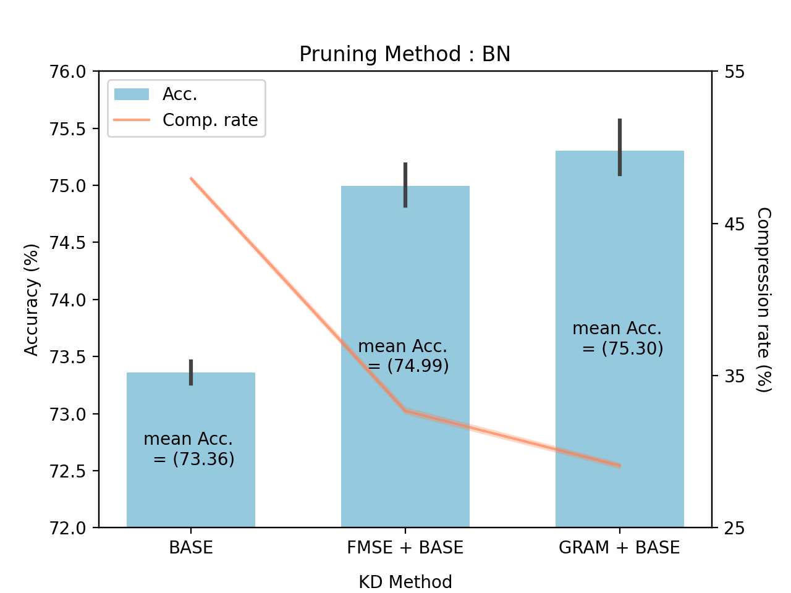

# Network Compression with Pruning and Knowledge Distillation

This project focuses on network compression techniques, specifically combining pruning and knowledge distillation methods to compress a ResNet50 model trained on the CIFAR100 dataset. The main objective is to evaluate various combinations of pruning and knowledge distillation methods.

## Overview

### Pruning Methods
We evaluate three pruning methods from [Torch-Pruning](https://github.com/VainF/Torch-Pruning/tree/master):
1. L1 Norm scale pruning
2. BatchNorm scale pruning (BN)
3. GroupNorm scale pruning (GN)

### Knowledge Distillation Methods
We evaluate three knowledge distillation approaches:
1. Base KD: Basic knowledge distillation that mimics teacher's predictions
2. FMSE + Base: Base KD followed by feature-level MSE loss distillation 
3. GRAM + Base: Base KD followed by feature-level [Gram loss](https://openaccess.thecvf.com/content_cvpr_2017/papers/Yim_A_Gift_From_CVPR_2017_paper.pdf) distillation


## Requirements

```
python==3.8
pytorch==2.1.1
pytorch-cuda==11.8
torchvision==0.16.1
onnx==1.14.1
onnxruntime==1.16.0
```

## Results

### Performance Metrics
Measured on Intel(R) Core(TM) i9-9900K CPU @ 3.60GHz with same random seed(0). You can download distilled models from 
[here](https://drive.google.com/drive/u/0/folders/1CJP5Eupx3iWTn2PUsxDUTeV_Dg27p8lZ)

#### Experiment 1. compress with prune_amount=0.3 (sorted by Acc.)

| Model Name              | Latency (ms) | Accuracy (%) | Parameters (M) | Pruning | KD        |
|-------------------------|--------------|--------------|----------------|---------|-----------|
| ResNet50                | 12.28        | 76.53        | 23             | None    | None      |
| P(0.3_BN)_KD(3)_SEED(0) | 9.8          | 75.39        | 16             | BN      | GRAM+Base |
| P(0.3_BN)_KD(1)_SEED(0) | 9.59         | 74.86        | 15             | BN      | FMSE+Base |
| P(0.3_GN)_KD(3)_SEED(0) | 11.63        | 74.15        | 19             | GN      | GRAM+Base |
| P(0.3_GN)_KD(1)_SEED(0) | 11.21        | 74.12        | 19             | GN      | FMSE+Base |
| P(0.3_BN)_KD(0)_SEED(0) | 6.36         | 73.23        | 12             | BN      | Base      |
| P(0.3_GN)_KD(0)_SEED(0) | 10.49        | 72.54        | 17             | GN      | Base      |
| P(0.3_L1)_KD(3)_SEED(0) | 8.62         | 72.32        | 16             | L1      | GRAM+Base |
| P(0.3_L1)_KD(1)_SEED(0) | 9.93         | 71.57        | 15             | L1      | FMSE+Base |
| P(0.3_L1)_KD(0)_SEED(0) | 7.32         | 69.51        | 12             | L1      | Base      |

Our experimental results demonstrate that BatchNorm-based pruning (BN) shows the best 
performance with regard to accuracy. While GroupNorm-based pruning (GN) exhibits 
comparable performance to BN, it yields lower compression efficiency. 
Among the knowledge distillation techniques, the combination of GRAM and Base distillation
demonstrates optimal performance, outperforming other methods.


#### Experiment 2. compress with prune_amount=0.4 (sorted by Acc.)

| Model Name              | Latency (ms) | Accuracy (%) | Parameters (M) | Pruning | KD        |
|-------------------------|--------------|--------------|----------------|---------|-----------|
| ResNet50                | 12.28        | 76.53        | 23             | None    | None      |
| P(0.4_BN)_KD(3)_SEED(0) | 8.73         | 74.41        | 14             | BN      | GRAM+Base |
| P(0.4_BN)_KD(1)_SEED(0) | 8.33         | 74.01        | 12             | BN      | FMSE+Base |
| P(0.4_BN)_KD(0)_SEED(0) | 4.77         | 70.80        | 9              | BN      | Base      |
| P(0.4_L1)_KD(3)_SEED(0) | 9.29         | 63.83        | 13             | L1      | GRAM+Base |
| P(0.4_L1)_KD(1)_SEED(0) | 8.74         | 57.98        | 12             | L1      | FMSE+Base |
| P(0.4_L1)_KD(0)_SEED(0) | 8.56         | 57.10        | 9              | L1      | Base      |

The observed results align with our previous findings using a prune amount of 0.3. 
Notably, the model with combination of BatchNorm-based pruning and GRAM knowledge distillation enables 
higher model compression while maintaining accuracy.

### Test with multiple random seeds


To account for stochastic variations, we conducted multiple experiments with 
BatchNorm-based pruning using different random seeds (0-4). The empirical results presented 
in above figure consistently demonstrate the superior performance of GRAM+Base knowledge distillation.

## Usage

### Training

To train the compressed model:

```bash
python train.py --orig-model={path-to-teacher-model} --prune-amount=0.3 --prune-method='BN' --kd-method=3 --outp-dir={path-to-save-student-model}
```

#### Parameters:
- `--prune-amount`: Compression ratio (e.g., 0.3)
- `--prune-method`: Choice of pruning method (`'L1'`, `'BN'`, or `'GN'`). See [Torch-Pruning](https://github.com/VainF/Torch-Pruning/tree/master) for details
- `--kd-method`: Knowledge distillation method:
  - `0`: Base KD
  - `1`: FMSE + Base
  - `3`: GRAM + Base (See [paper](https://openaccess.thecvf.com/content_cvpr_2017/papers/Yim_A_Gift_From_CVPR_2017_paper.pdf) for details)
- `--outp-dir`: Directory to save the compressed PyTorch model

### Export to ONNX

To export your trained PyTorch model to ONNX format:

```bash
python export.py --torch-file={path-to-torch-model} --out-file={path-to-output-onnx-model}
```

### Performance Testing

To evaluate the ONNX model's performance:

```bash
python test.py --onnx-file={path-to-onnx-model}
```

This outputs:
- Number of parameters
- Latency
- Accuracy
